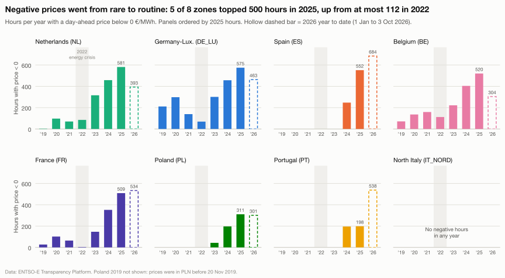
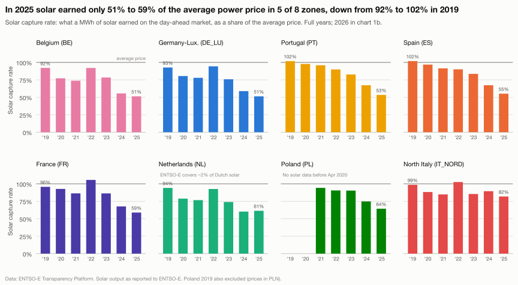
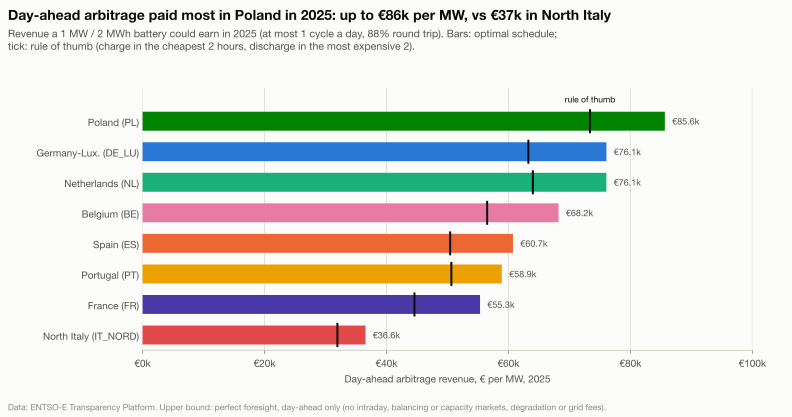
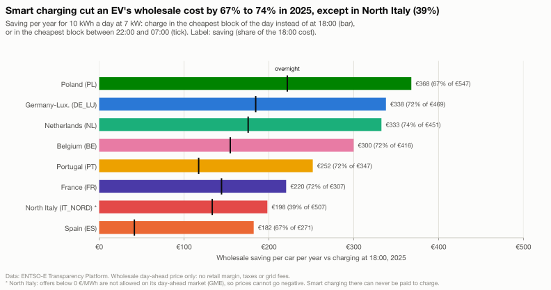

# Negative Hours
### Europe's electricity market in the renewables era

> How often is power free in Europe — and what is a battery worth in each country?

**Status:** 🚧 In progress (started 2026-10-01) · Live dashboard: _coming soon_ · Write-up: _coming soon_

---

## The problem

Solar and wind now push European wholesale electricity prices to **zero or below** for hours at a time. That breaks old business models (solar farms earn less exactly when they produce most) and creates new ones (batteries get paid to absorb free power). This project measures how big that shift is, country by country, and turns it into decisions.

## Questions

| # | Question | Business output |
|---|----------|-----------------|
| Q1 | How often are prices negative, by country and year? | Trend + country ranking |
| Q2 | Does solar cannibalise its own value? | Solar capture price & capture rate |
| Q3 | Where should you build a battery? | Estimated €/MW/year arbitrage revenue by country |
| Q4 | When should EVs and fleets charge? | Cheapest charging windows by country & season |

## Architecture

```
ENTSO-E API ──► pipeline/ (Python) ──► data/raw (Parquet)
                                         │
                                         ▼
                              warehouse/ (DuckDB + dbt)
                              staging → intermediate → marts
                                         │
                       ┌─────────────────┴─────────────────┐
                       ▼                                   ▼
                analysis/ (notebooks)              dashboard/ (live)
                       │
                       ▼
                docs/ (exec memo)
        Scheduled refresh: GitHub Actions
```

## Repo layout

| Folder | What lives there |
|--------|------------------|
| `pipeline/` | Data extraction from the ENTSO-E Transparency Platform |
| `warehouse/` | dbt project: models, tests, documentation |
| `models/` | Python models: battery arbitrage linear program (Q3) |
| `analysis/` | Notebooks answering Q1–Q4 |
| `dashboard/` | Live dashboard source |
| `docs/` | Exec memo, figures, methodology |
| `control-room/` | Obsidian vault: project brief, roadmap, decision log, daily log |

## Data source

[ENTSO-E Transparency Platform](https://transparency.entsoe.eu/) — official European grid data (day-ahead prices, generation by source, load).

## Results

### Q1 · How often are prices negative?



- **Rare → routine.** In 2025, 5 of the 8 zones had more than 500 hours of negative day-ahead prices; in 2022 the highest was 112.
- **Frequency ≠ depth.** Spain had nearly as many negative hours as Germany in 2025 (551.5 vs 574.75), but they averaged −2.11 €/MWh vs −10.92.
- **North Italy has never gone negative** (2019 to Oct 2026), an open question.

Notebook: [`analysis/q1_negative_hours.ipynb`](analysis/q1_negative_hours.ipynb) · Metric: [ADR-005](control-room/04%20Decisions/ADR-005%20Negative%20Hours%20Metric.md)

### Q2 · Does solar cannibalise its own value?



- **Solar earns about half the average price.** In 2025 its capture rate was 51 to 59% in Belgium, Germany, Portugal, Spain and France, down from 92 to 102% in 2019. Germany's 2024 solar capture price (46.23 €/MWh) matches the published German solar market value.
- **More solar, less value, everywhere.** In all 7 zones with usable data, solar's share rose and its capture rate fell from 2019 to 2025 (Spain: 6% solar at 102% → 20% at 55%).
- **Wind holds up.** Wind kept 86 to 97% of the average price in 2025.
- **2022 was a timing effect.** Capture rates jumped in 2022 outside Iberia because the most expensive months (July to September) were also the sunniest; in Spain and Portugal prices peaked in January to March and fell after the Iberian gas price cap started (15 June 2022). The within-month erosion kept going every year.
- **Local or regional?** France's and Belgium's capture rates track the coupled region's solar share as closely as their own; with yearly data the two can't be separated (inconclusive).
- **Caveat:** generation is *as reported to ENTSO-E*; the Netherlands series misses ~98% of Dutch solar, so NL solar figures are indicative only.

Notebook: [`analysis/q2_capture_prices.ipynb`](analysis/q2_capture_prices.ipynb) · Method: [ADR-006](control-room/04%20Decisions/ADR-006%20Hourly%20Grid%20and%20Capture%20Prices.md)

### Q3 · Where is a battery worth the most?



- **Up to €86k per MW in 2025.** A 1 MW / 2 MWh battery trading the day-ahead market could have earned at most €85.6k per MW in Poland, €76.1k in Germany and the Netherlands, and €36.6k in North Italy. Germany 2024 (€66k) is in line with a published day-ahead-only estimate (~€70k, Gridcog).
- **2026 is already ahead.** By 3 October, 2026 had out-earned all of 2025 in every zone; 15-minute prices (since Oct 2025) add 2 to 10% of that.
- **Negative hours are a signal, not the money.** Zones and years with more negative hours earned more (r = 0.76 without 2022), but being paid to charge was at most 11% of a year's revenue.
- **Longer batteries earn more, less per hour added.** In 2025, 4 hours earned 64 to 76% more than 2 hours.
- **Caveat:** an upper bound for one market: perfect foresight on cleared day-ahead prices, 1 cycle a day, 88% round trip. Excludes intraday, balancing and capacity markets, degradation, grid fees and all costs. Not investment advice.

Notebook: [`analysis/q3_battery_arbitrage.ipynb`](analysis/q3_battery_arbitrage.ipynb) · Model: [ADR-007](control-room/04%20Decisions/ADR-007%20Battery%20Arbitrage%20Model.md), [`models/battery.py`](models/battery.py)

### Q4 · When should EVs charge?



- **The cheap hours moved to midday.** The cheapest hour of the day started at 03:00 or 04:00 in 2019 in every zone, and at 12:00 to 14:00 in 2025; from March to September 2025 it fell between 12:00 and 16:00 everywhere.
- **Smart charging cuts the wholesale cost by about 70%.** For 10 kWh a day at 7 kW, charging in the cheapest block of the day instead of at 18:00 saved €182 to €368 a year in 2025 (67% to 74%; North Italy 39%).
- **"Charge at night" is losing its edge.** Overnight charging got 88% to 100% of the smart saving in 2019, only 23% to 67% in 2025; in Spain it now costs more than charging at 18:00.
- **Caveat:** wholesale day-ahead price only: retail margins, taxes and grid fees are excluded, so these are not household bills.

Notebook: [`analysis/q4_ev_charging.ipynb`](analysis/q4_ev_charging.ipynb) · Method: [ADR-008](control-room/04%20Decisions/ADR-008%20EV%20Charging%20Strategies.md)

All findings, with exact numbers and caveats: [`control-room/06 Findings/`](control-room/06%20Findings/)

## Run it locally

You need [uv](https://docs.astral.sh/uv/) and a free ENTSO-E API token
(create an account on the [Transparency Platform](https://transparency.entsoe.eu/), then request
"Restful API access" by email; the token appears in your account settings once approved).

```bash
git clone https://github.com/Sbaiii/negative-hours.git
cd negative-hours
uv sync                       # creates .venv with Python 3.12 and all dependencies
cp .env.example .env          # then paste your token after ENTSOE_API_KEY=
```

**Download the data** (8 bidding zones, 2019 → today):

```bash
uv run python -m pipeline.extract                                      # everything
uv run python -m pipeline.extract --datasets prices                    # one dataset
uv run python -m pipeline.extract --zones ES DE_LU --start-year 2024   # a subset
uv run python -m pipeline.extract --force                              # re-download existing files
```

| `--datasets` | ENTSO-E source | Columns |
|---|---|---|
| `prices` | Day-ahead prices | `ts_utc` · `zone` · `price_eur_mwh` · `resolution_minutes` |
| `generation` | Actual generation per production type | `ts_utc` · `zone` · `production_type` · `generation_mw` · `resolution_minutes` |
| `load` | Actual total load | `ts_utc` · `zone` · `load_mw` · `resolution_minutes` |

Output is one Parquet file per dataset, zone and year, e.g.
`data/raw/generation/zone=ES/year=2024.parquet`.

- Timestamps are UTC (start of the period); a "year" is a UTC calendar year.
- `resolution_minutes` is read from the data, never assumed. Prices are 60 until the market
  switched to 15-minute products on 2025-10-01, then 15; generation and load vary by zone
  (and by production type).
- Generation is in long format (one row per type per period) and keeps only what plants
  feed in: pumped-storage *consumption* is dropped.
- Files for past years are skipped if they already exist; the current year is always refreshed.
- Prices are requested a year at a time, generation and load a month at a time; each
  request is retried with backoff on rate limits and server errors.

**Build the warehouse** (dbt + DuckDB, run from `warehouse/`):

```bash
cd warehouse
uv run dbt build            # seed, models and tests → data/warehouse.duckdb
cd ..
uv run python -m models.run_battery        # battery LP for every zone-day (~3 min) → battery.arbitrage_daily
cd warehouse
uv run dbt build --select fct_battery_arbitrage   # Q3 mart from the LP results
uv run dbt docs generate    # then `uv run dbt docs serve` to browse model docs
cd ..
uv run python analysis/export_outputs.py   # marts → analysis/outputs/*.csv
```

---

Built by [Abdellah Sbai](https://sbaiii.com)
