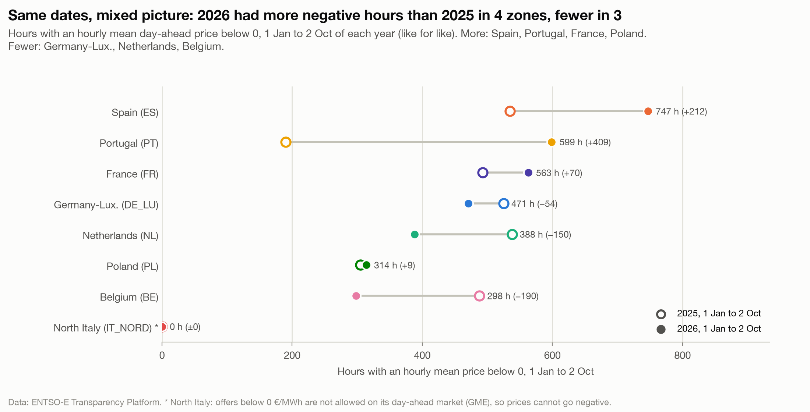

# Negative prices went from rare to routine

**Question:** Q1 · **Date:** 2026-10-03 · **Updated:** 2026-10-04

## Headline
In 2025, 5 of the 8 zones had more than 500 negative hours; before 2023 no zone ever exceeded 298 (Germany-Luxembourg, 2020).

## Evidence

Full years (hours whose hourly mean day-ahead price was below 0 €/MWh):

| Zone | 2022 | 2023 | 2024 | 2025 |
|---|---:|---:|---:|---:|
| NL | 85 | 316 | 458 | 584 |
| DE_LU | 69 | 301 | 457 | 576 |
| ES | 0 | 0 | 247 | 556 |
| BE | 112 | 222 | 404 | 519 |
| FR | 4 | 147 | 352 | 513 |
| PL | 0 | 43 | 197 | 310 |
| PT | 0 | 0 | 196 | 200 |
| IT_NORD | 0 | 0 | 0 | 0 |

- Germany-Luxembourg went from 69 h (2022) to 576 h (2025), 8.3× more.
- Spain and Portugal had **no** negative hours until 2024 (ES 247 h, PT 196 h in 2024).
- Before 2023 the highest count in any zone and year was 298 (DE_LU 2020).

**2026, like for like.** 2026 is not over, so it is only compared with the same window of 2025 (1 Jan to 2 Oct, the as-of date of snapshot `analysis/outputs/snapshots/2026-10-02/`):

| Zone | 1 Jan to 2 Oct 2025 | 1 Jan to 2 Oct 2026 | Change |
|---|---:|---:|---:|
| ES | 535 | 747 | +212 |
| PT | 190 | 599 | +409 |
| FR | 493 | 563 | +70 |
| PL | 305 | 314 | +9 |
| DE_LU | 525 | 471 | −54 |
| NL | 538 | 388 | −150 |
| BE | 488 | 298 | −190 |
| IT_NORD | 0 | 0 | 0 |

- Over the same dates, 2026 had more negative hours than 2025 in Spain, Portugal, France and Poland, and fewer in Germany-Luxembourg, the Netherlands and Belgium. No cause is claimed here.

North Italy cannot go negative by market rule: GME accepts day-ahead offers only at or above 0 €/MWh ([[Q1-3 Share of hours at or below zero 2026|Q1-3]]), so its 0 reflects market design, not only its generation mix.

## Method
`fct_negative_hours` (full years) and `fct_ytd_comparison` (same window each year), notebook `analysis/q1_negative_hours.ipynb`, charts 1 and 1b. A negative hour is an hour whose hourly mean price is below 0, the convention of published counts; local calendar years ([[04 Decisions/ADR-005 Negative Hours Metric|ADR-005]]). Checked against published counts: Germany 2019 to 2024 exact; France 2023 (147), 2024 (352) and 2025 (513) exact against RTE; Spain 2025: 556 vs 556 and 555 in two pv-magazine reports (see ADR-005).

## Caveats
- 2026 is only compared with the same window of 2025, never with a full year.
- Poland 2019 is excluded (prices in PLN before 2019-11-20).
- This counts how often prices are negative, not why. No causes are claimed here.

## So what?
Negative prices are no longer an edge case in 7 of 8 zones. Anyone valuing flexible assets (batteries, flexible demand, EV charging) should model hundreds of negative hours a year, not a handful. Q3 (battery value) and Q4 (charging windows) build on this.
