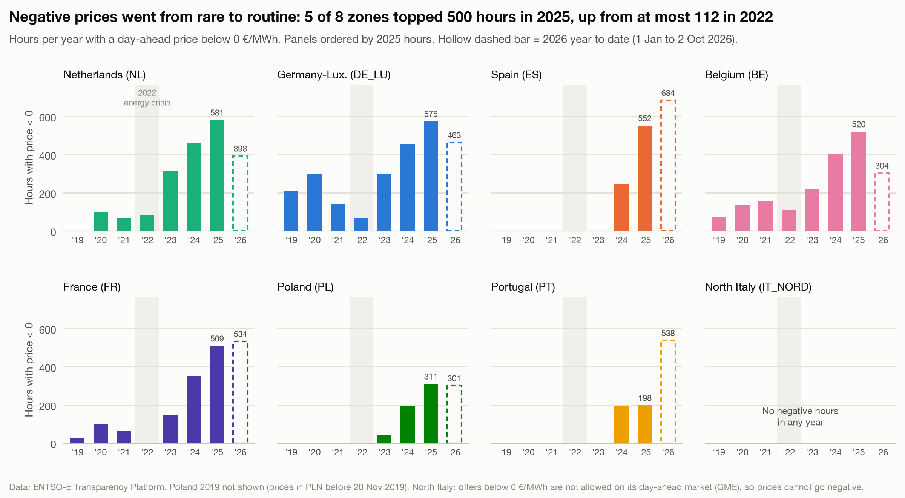

# Negative prices went from rare to routine

**Question:** Q1 · **Date:** 2026-10-03

## Headline
In 2025, 5 of the 8 zones had more than 500 hours of negative day-ahead prices; in 2022 the highest was 112 (Belgium).

## Evidence

| Zone | 2022 | 2023 | 2024 | 2025 | 2026 to 2 Oct* |
|---|---:|---:|---:|---:|---:|
| NL | 85 | 316 | 458 | 581.25 | 393 |
| DE_LU | 69 | 301 | 457 | 574.75 | 463.25 |
| ES | 0 | 0 | 247 | 551.5 | 684.25 |
| BE | 112 | 222 | 404 | 520.25 | 303.75 |
| FR | 4 | 147 | 352 | 509.25 | 533.75 |
| PL | 0 | 43 | 197 | 310.75 | 301.25 |
| PT | 0 | 0 | 196 | 198.5 | 538 |
| IT_NORD | 0 | 0 | 0 | 0 | 0 |

\*1 Jan to 2 Oct 2026, the as-of date of snapshot `analysis/outputs/snapshots/2026-10-02/` (all zones cut at the same day, ADR-005). Hours with price < 0 €/MWh.

North Italy cannot go negative by market rule: GME accepts day-ahead offers only at or above 0 €/MWh ([[Q1-3 Share of hours at or below zero 2026|Q1-3]]), so its 0 here reflects market design, not only its generation mix.

- Germany-Luxembourg went from 69 h (2022) to 574.75 h (2025), 8.3× more.
- Spain and Portugal had **no** negative hours until 2024 (ES 247 h, PT 196 h in 2024).
- As of 2 Oct 2026, Spain (684.25 h), France (533.75 h) and Portugal (538 h) have already passed their full-year 2025 totals.

## Method
`fct_negative_hours` (dbt), notebook `analysis/q1_negative_hours.ipynb`, chart 1. Hours = summed period durations in local calendar years ([[04 Decisions/ADR-005 Negative Hours Metric|ADR-005]]). Checked against published counts: Germany 2019 to 2024 exact (211, 298, 139, 69, 301, 457); France 2023 exact (147, RTE); France 2024 352 vs 359 published by RTE (see ADR-005).

## Caveats
- 2026 is year to date; compare full years only.
- Poland 2019 is excluded (prices in PLN before 2019-11-20).
- This counts how often prices are negative, not why. No causes are claimed here.

## So what?
Negative prices are no longer an edge case in 7 of 8 zones. Anyone valuing flexible assets (batteries, flexible demand, EV charging) should model hundreds of negative hours a year, not a handful. Q3 (battery value) and Q4 (charging windows) build on this.
