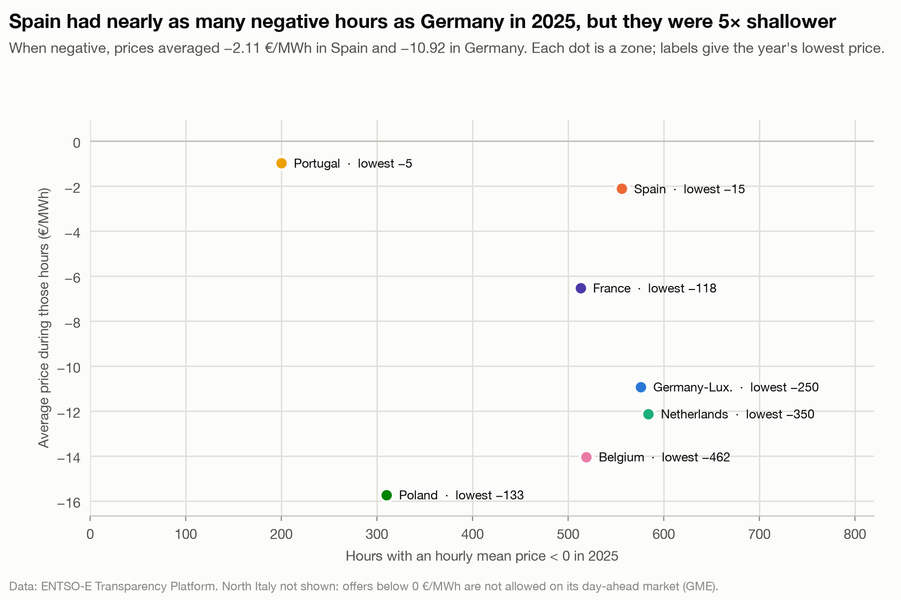

# Iberia goes negative often but shallow; DE, NL and BE go much deeper

**Question:** Q1 · **Date:** 2026-10-03

## Headline
In 2025 Spain had nearly as many negative hours as Germany (551.5 vs 574.75), but its average negative price was −2.11 €/MWh against −10.92: about 5× shallower.

## Evidence

| Zone (2025) | Negative hours | Avg price when negative (€/MWh) | Lowest price (€/MWh) |
|---|---:|---:|---:|
| NL | 581.25 | −12.12 | −350.00 |
| DE_LU | 574.75 | −10.92 | −250.32 |
| ES | 551.5 | −2.11 | −15.00 |
| BE | 520.25 | −14.03 | −462.33 |
| FR | 509.25 | −6.52 | −118.01 |
| PL | 310.75 | −15.72 | −132.95 |
| PT | 198.5 | −0.97 | −5.00 |
| IT_NORD | 0 | n/a | 0.00 |

- Iberia (ES, PT): negative prices averaged −0.97 to −2.11 and never fell below −15.
- Germany, the Netherlands and Belgium: averages −10.92 to −14.03, lows from −250 to −462 (the SDAC floor is −500).
- On *frequency*, Iberia is not ahead in 2025: NL and DE_LU had slightly more negative hours than ES. Counting zero prices too, ES leads (804.75 h at or below 0 vs 661.5 for DE_LU).

## Method
`fct_negative_hours`: `negative_hours`, `avg_price_negative_periods` (duration-weighted), `min_price`, local year 2025. Notebook chart 2.

## Caveats
- One year only (2025). The depth pattern should be checked on 2024 and 2026 before generalising.
- The lowest price is a single period; the average is the better measure of typical depth.
- No cause is claimed for the difference in depth.

## So what?
For anything paid to absorb power at negative prices (batteries, flexible demand), **depth matters as much as count**: an hour at −11 €/MWh is worth ~5× an hour at −2. A battery case in Spain can't reuse German assumptions. This feeds directly into Q3.
