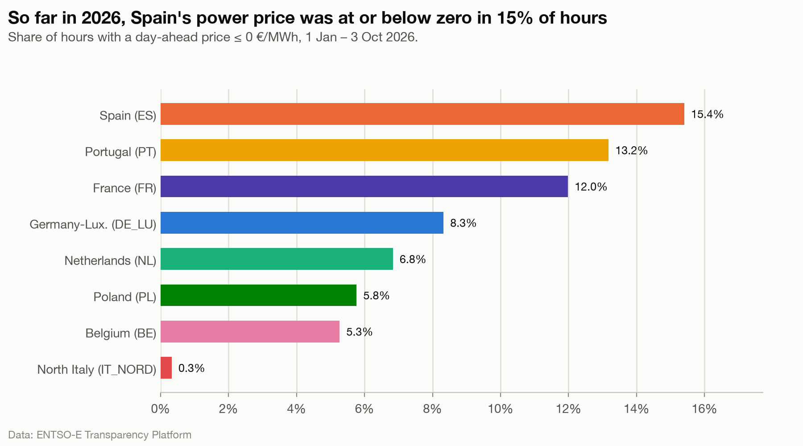

# A third of Spain's time at or below zero in 2026 was at exactly zero

**Question:** Q1 · **Date:** 2026-10-03 · **Updated:** 2026-10-04

## Headline
From 1 January to 2 October 2026 (as-of date), Spain's day-ahead price was at or below 0 €/MWh for 15.5% of the time (1,020.25 of 6,599 h), and a third of that time (336 h, 32.9%) was at **exactly** 0 rather than below it.

## Evidence

Measured on individual price periods (a 15-min period counts 0.25 h), not on hourly means: whether a price is exactly zero is a property of each cleared price, and averaging to the hour would hide it.

| Zone (2026 to 2 Oct) | Hours < 0 | Hours = 0 | Hours ≤ 0 | Share of time ≤ 0 | …of which exactly 0 |
|---|---:|---:|---:|---:|---:|
| ES | 684.25 | 336 | 1,020.25 | 15.5% | 32.9% |
| PT | 538 | 334.5 | 872.5 | 13.2% | 38.3% |
| FR | 533.75 | 259.75 | 793.5 | 12.0% | 32.7% |
| DE_LU | 463.25 | 87.75 | 551 | 8.3% | 15.9% |
| NL | 393 | 59.5 | 452.5 | 6.9% | 13.1% |
| PL | 301.25 | 80.5 | 381.75 | 5.8% | 21.1% |
| BE | 303.75 | 45 | 348.75 | 5.3% | 12.9% |
| IT_NORD | 0 | 21.5 | 21.5 | 0.3% | 100% |

Hours covered in 2026: 6,599 for every zone (1 Jan to 2 Oct; all zones cut at the same as-of date, ADR-005). Snapshot: `analysis/outputs/snapshots/2026-10-02/`.

- In 2026, in Spain, Portugal and France about a third of the time at or below zero is at exactly 0 (32.7% to 38.3%); in Germany, the Netherlands and Belgium only 12.9% to 15.9%.
- On hourly means (the headline Q1 convention) the counts are lower for zeros: Spain 2026 to 2 Oct had 747 hours with a mean below 0 and 907 at or below 0.

## Method
`fct_negative_hours`, local year 2026: below 0 = `negative_period_hours`, exactly 0 = `zero_or_negative_period_hours − negative_period_hours`, both divided by `covered_hours`. Notebook chart 3 (stacked bar).

## Caveats
- 2026 runs from January to early October, so it holds most of the spring and summer, when zero and negative prices cluster, and only a little of the winter. A 2026 share is higher than a full-year share for that reason alone; it is not compared with full years here.
- "At or below zero" (≤ 0) is wider than the headline Q1 metric (< 0); see [[04 Decisions/ADR-005 Negative Hours Metric|ADR-005]].

## Why North Italy is never negative: a market rule
North Italy had no negative price in any year from 2019 to 2 Oct 2026; its lowest price is exactly 0 €/MWh, held for 5 h in 2020, 10 h in 2025 and 21.5 h in 2026 to 2 Oct (price periods). That is what the Italian rules allow:
- GME's technical rule on price limits for the day-ahead (MGP) and intraday markets requires sale offers **greater than or equal to 0 €/MWh** and purchase offers greater than 0 (a purchase offer at 0 means "no price limit"). So no Italian offer can clear below 0. Source: [GME, Disposizione tecnica di funzionamento n. 12 MPE, "Limiti di prezzo", published 24 Feb 2015](https://www.mercatoelettrico.org/portals/0/Documents/it-IT/20150220DTF12MPE.pdf), issued under article 26.2 of GME's market rules ([Testo integrato della Disciplina del mercato elettrico](https://www.mercatoelettrico.org/Portals/0/Documents/it-it/20241001_Testo_Integrato_ME.pdf)).
- The regulator ARERA consulted in 2015 on adding a −500 €/MWh floor in MGP and MI to align with the rest of the coupled European market ([ARERA consultation 605/2015/R/eel, 14 Dec 2015](https://www.arera.it/en/schede-tecniche/dettaglio/it/schedetecniche/15/605-15st)). We found no primary source showing it was adopted, or a date for allowing negative prices; GME's January 2026 vademecum of the power exchange describes no change. Market commentary expects negative prices after the TIDE dispatching reform, but we could not confirm this in a GME or ARERA document, so no date is given here.
- Consistent with the data: exact-zero prices occur (the floor binds), negatives never do.

So IT_NORD's position in any ranking of negative hours, battery value (Q3) or EV savings (Q4) partly reflects this market design, not only how much solar or wind it has.

## So what?
Over a full year the window is smaller than 2026 to date suggests: in 2025 the price was at or below zero for 9.2% of the time in Spain, 8.5% in France and 4.7% in Portugal (price periods). That is the size of the window Q4 (EV charging) can target.
