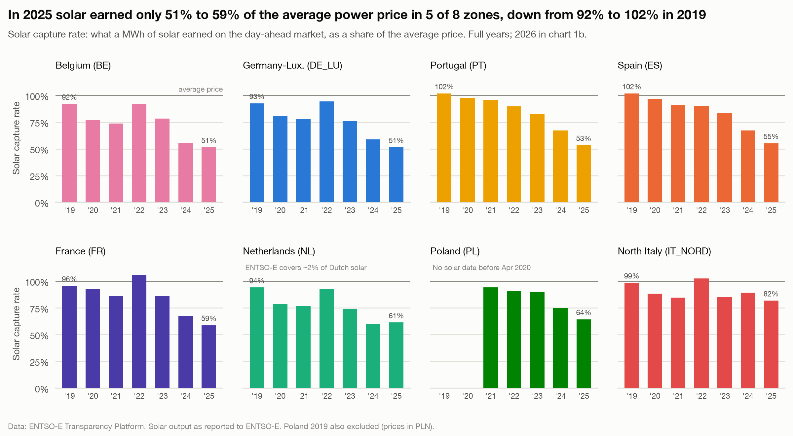

# Solar now earns about half the average power price in most zones

**Question:** Q2 · **Date:** 2026-10-03

## Headline
In 2025, a MWh of solar earned only 51 to 59% of the average day-ahead price in 5 of 8 zones (BE, DE_LU, PT, ES, FR); in 2019 the same zones were at 92 to 102%.

## Evidence

| Zone | Capture rate 2019 | Capture rate 2025 | Solar capture price 2025 (€/MWh) | Baseload 2025 (€/MWh) | 2026 to 2 Oct |
|---|---:|---:|---:|---:|---:|
| BE | 92.1% | 51.4% | 42.46 | 82.57 | 55.7% |
| DE_LU | 92.7% | 51.4% | 45.94 | 89.32 | 51.8% |
| PT | 101.9% | 53.4% | 35.34 | 66.18 | 50.2% |
| ES | 101.9% | 55.2% | 36.05 | 65.29 | 50.7% |
| FR | 95.7% | 58.9% | 35.94 | 61.07 | 54.0% |
| NL* | 94.2% | 61.4% | 53.29 | 86.81 | 59.0% |
| PL | 94.2% (2021) | 64.4% | 67.16 | 104.29 | 58.8% |
| IT_NORD | 98.6% | 81.8% | 94.82 | 115.86 | 84.6% |

\*NL: ENTSO-E's solar series covers ~2% of Dutch output; indicative only. PL: solar reported from April 2020, first full year 2021.

- The decline is not a straight line: in 2022 the rate rose again in DE_LU (77.9% → 94.4%), BE, NL, FR and IT_NORD, but not in ES, PT or PL. This note does not try to explain why.
- North Italy is the outlier: 81.8% in 2025, the only zone above 65%.

## Method
`fct_capture_prices` (dbt): capture price = Σ(price × solar MWh) / Σ(solar MWh), each generation period priced over its own span (15-min where both series are 15-min, from Oct 2025); rate = capture / time-weighted baseload over all price hours (= Q1 `avg_price`) ([[04 Decisions/ADR-006 Hourly Grid and Capture Prices|ADR-006]]). Notebook `analysis/q2_capture_prices.ipynb`, chart 1.
**Check:** DE_LU 2024 solar capture price 46.23 €/MWh vs the published German solar market value of 4.624 ct/kWh (Netztransparenz).

## Caveats
- Solar output is as reported to ENTSO-E (see Data Dictionary). NL is unreliable; other zones were not all checked against national statistics.
- Day-ahead prices only: intraday, balancing and support schemes are not included.
- 2026 is year to date: 1 Jan to 2 Oct, the as-of date (snapshot `analysis/outputs/snapshots/2026-10-02/`).

## So what?
A solar business case that assumes the average power price overstates revenue by roughly 2× in most of these zones. Developers and lenders should model a capture rate, not the baseload price.
