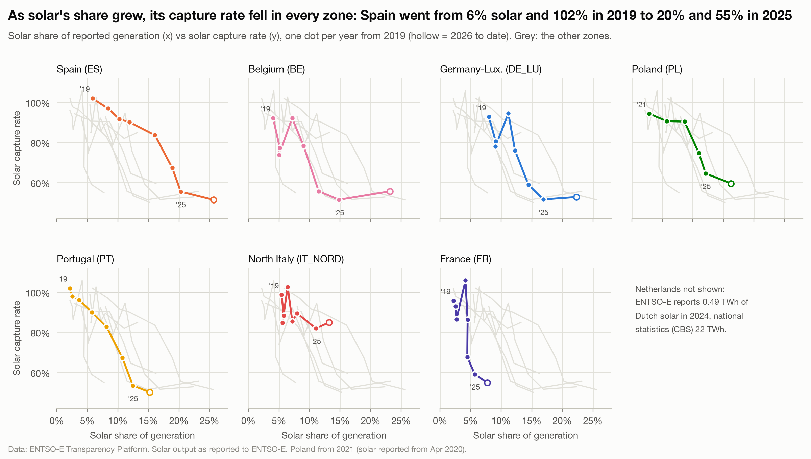

# As solar's share grew, its capture rate fell in every zone

**Question:** Q2 · **Date:** 2026-10-03

## Headline
Between 2019 and 2025, solar's share of reported generation rose and its capture rate fell in all 7 zones with usable data (the Netherlands left out; Poland from 2021, its first full year of solar data); Spain went from 5.9% solar and a 101.9% capture rate to 20.3% and 55.2%.

## Evidence

| Zone | First year | Solar share | Capture rate | → 2025 share | 2025 rate |
|---|---|---:|---:|---:|---:|
| ES | 2019 | 5.9% | 101.9% | 20.3% | 55.2% |
| DE_LU | 2019 | 8.0% | 92.7% | 16.9% | 51.4% |
| BE | 2019 | 4.0% | 92.1% | 14.8% | 51.4% |
| PT | 2019 | 2.2% | 101.9% | 12.5% | 53.4% |
| PL | 2021 | 2.9% | 94.2% | 12.1% | 64.4% |
| IT_NORD | 2019 | 5.4% | 98.6% | 11.0% | 81.8% |
| FR | 2019 | 2.2% | 95.7% | 5.7% | 58.8% |

- **Share alone doesn't set the rate.** At similar shares in 2025, North Italy (11.0%) kept 81.8%, Poland (12.1%) 64.4% and Portugal (12.5%) only 53.4%. France fell to 58.8% at just 5.7% solar.
- 2026 is not a full year, so it is not on this curve. Over the same dates (1 Jan to 2 Oct), Spain's capture rate fell from 54.0% in 2025 to 50.7% in 2026 and Portugal's from 51.1% to 50.2% (see [[Q2-1 Solar earns about half the average price|Q2-1]]).

## Method
`fct_capture_prices`: `solar_share` = solar MWh / total reported generation MWh; `solar_capture_rate` as in Q2-1. Notebook chart 2 (one panel per zone, other zones in grey). The Netherlands is left out: ENTSO-E reports 0.49 TWh of Dutch solar in 2024 vs 22 TWh in CBS statistics.

## Caveats
- Share is of *reported generation* in the zone, not of consumption, and imports/exports are ignored.
- 7 zones × ~7 years is a small sample; this shows a consistent direction, not a fitted curve or a cause.

## So what?
Zones further along the curve (ES, DE_LU, BE, PT) show what happens to solar revenue as others add capacity. A forecast for a zone at 5 to 10% solar today should not assume today's capture rate holds.
