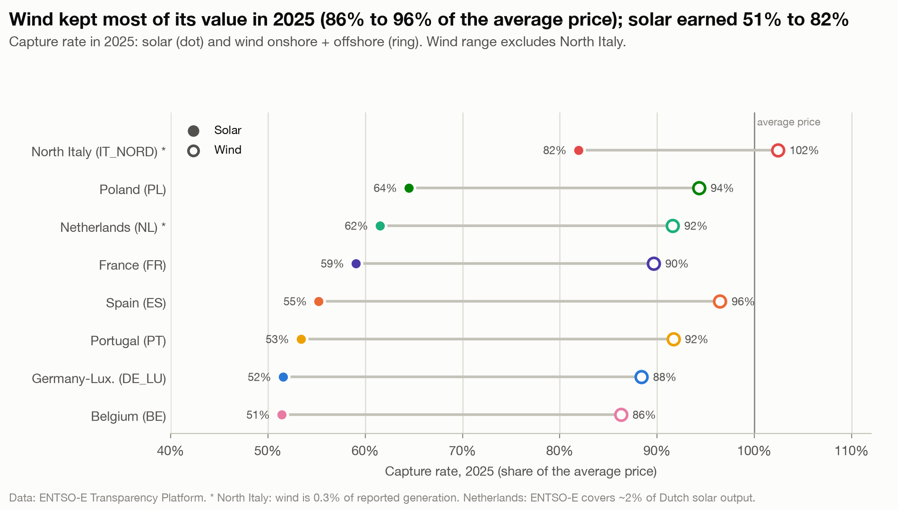

# Wind does not suffer the same: it kept 86 to 97% of the average price in 2025

**Question:** Q2 · **Date:** 2026-10-03

## Headline
In 2025, wind earned 86 to 97% of the average day-ahead price in 7 zones (North Italy's 102.4% left out: wind is only 0.3% of its reported generation; the Netherlands' 91.6% is included: its wind series is usable, only its solar series is incomplete), while solar earned 51 to 82% (8 zones).

## Evidence

| Zone | Solar rate | Wind rate | Gap (points) | Solar capture (€/MWh) | Wind capture (€/MWh) | Wind share |
|---|---:|---:|---:|---:|---:|---:|
| BE | 51.4% | 86.3% | 34.9 | 42.46 | 71.24 | 17.7% |
| DE_LU | 51.4% | 88.4% | 37.0 | 45.94 | 78.95 | 30.4% |
| PT | 53.4% | 91.7% | 38.3 | 35.34 | 60.67 | 27.5% |
| ES | 55.2% | 96.8% | 41.6 | 36.05 | 63.20 | 21.5% |
| FR | 58.8% | 89.6% | 30.8 | 35.94 | 54.75 | 9.1% |
| NL* | 61.4% | 91.6% | 30.2 | 53.29 | 79.51 | 19.3% |
| PL | 64.4% | 94.3% | 29.9 | 67.16 | 98.37 | 13.8% |
| IT_NORD** | 81.8% | 102.4% | 20.6 | 94.82 | 118.68 | 0.3% |

\*NL solar indicative only. \*\*IT_NORD wind is 0.3% of reported generation, too small to compare; left out of the wind range.

- The gap is widest in Spain: wind 96.8% vs solar 55.2%.
- In Germany, a MWh of wind earned 78.95 €/MWh in 2025 and a MWh of solar 45.94.

## Method
`fct_capture_prices`: wind = Wind Onshore + Wind Offshore, same capture-rate formula as solar ([[04 Decisions/ADR-006 Hourly Grid and Capture Prices|ADR-006]]). Notebook chart 3.

## Caveats
- One year (2025). Wind capture rates in earlier years ranged from 73.7% (DE_LU 2022) upward; check the full series before generalising.
- No claim is made here about why wind holds its value better.

## So what?
The value erosion is mostly a solar problem so far, which suggests that adding storage or wind to a solar portfolio could limit exposure to it (not tested here). Q3 will check whether the cheapest hours a battery can buy are the solar hours.
