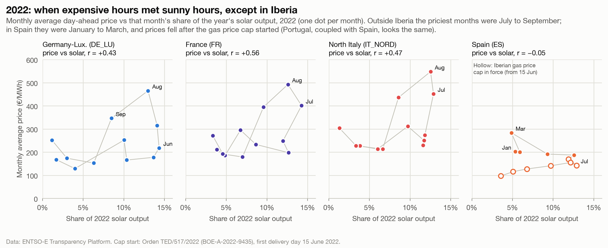

# 2022: expensive months met sunny months, except in Iberia

**Question:** Q2 · **Date:** 2026-10-03

## Headline
Solar capture rates jumped in 2022 outside Iberia because the year's most expensive months (July to September) were also its sunniest. 2022 is the only year where monthly price and solar output moved together in those zones (r = +0.39 to +0.56). In Spain and Portugal the priciest months were January to March (r ≈ 0).

## Evidence

Annual capture rate = **seasonal part** × **within-month part**. The seasonal part is the rate you'd get from monthly averages only: above 1 means sunny months were the expensive ones.

| Zone | Seasonal 2021 | Seasonal 2022 | Within-month 2021 | Within-month 2022 | Capture rate 2021 → 2022 | r (monthly price vs solar), 2022 | 3 priciest months 2022 |
|---|---:|---:|---:|---:|---:|---:|---|
| DE_LU | 0.847 | **1.094** | 0.919 | 0.863 | 77.9% → 94.4% | +0.43 | Aug, Sep, Jul |
| NL | 0.830 | **1.089** | 0.925 | 0.850 | 76.7% → 92.6% | +0.47 | Aug, Sep, Jul |
| FR | 0.875 | **1.084** | 0.987 | 0.975 | 86.4% → 105.7% | +0.56 | Aug, Jul, Sep |
| BE | 0.805 | **1.076** | 0.916 | 0.855 | 73.7% → 92.0% | +0.39 | Aug, Sep, Jul |
| IT_NORD | 0.850 | **1.072** | 0.998 | 0.957 | 84.8% → 102.6% | +0.47 | Aug, Jul, Sep |
| PL | 0.931 | **1.068** | 1.012 | 0.848 | 94.2% → 90.5% | +0.49 | Aug, Jul, Jun |
| ES | 0.957 | 0.995 | 0.955 | 0.905 | 91.5% → 90.1% | −0.05 | Mar, Jan, Feb |
| PT | 1.005 | 1.001 | 0.955 | 0.899 | 96.0% → 89.9% | −0.00 | Mar, Jan, Feb |

- In every other year from 2019 to 2025, the seasonal part was 0.805 to 1.015 in all zones, and monthly price vs solar correlated negatively outside Iberia (except PL 2023, +0.06).
- The **within-month** part fell in 2022 in every zone, continuing its decline every year since 2019. The 2022 jump is entirely seasonal.
- **Iberia:** Spanish prices peaked in March 2022 (283.39 €/MWh). From June they stayed between 96.95 and 169.63, while August reached 465.18 in DE_LU, 492.49 in FR and 547.60 in IT_NORD. Spain's gas price cap applied from the day-ahead auction for delivery on **15 June 2022** (Orden TED/517/2022, BOE-A-2022-9435, under Real Decreto-ley 10/2022).

## What the data supports
- The 2022 rise in capture rates outside Iberia is explained, arithmetically, by expensive months coinciding with sunny months. It does not come from solar hours being priced better *within* each month.
- In Spain and Portugal that coincidence did not happen; their 2022 rates fell.
- The timing is **consistent** with the Iberian cap: Iberian summer prices diverged from their neighbours' from June 2022.

## What it does not support
- **Why** summer 2022 prices were so high elsewhere. The causes (gas prices, other supply issues) are not in this dataset and are not claimed here.
- That the cap **caused** lower Iberian summer prices. There is no counterfactual here, only a difference in timing.
- **Poland does not fit the premise neatly.** It had the same seasonal alignment (1.068, priciest months Aug, Jul, Jun), but its within-month part fell sharply (1.012 → 0.848), so its annual rate still dropped. Why is not tested here.

## Method
`fct_solar_monthly` (dbt), notebook `analysis/q2_capture_prices.ipynb` (section "Why did 2022 lift solar capture rates"). Seasonal part = Σ(monthly baseload × monthly solar MWh) / Σ(solar MWh) / annual baseload (days-weighted); within-month = annual capture rate / seasonal part.

## So what?
A single year's capture rate can be pushed up or down by *when* prices spike, independent of solar's own growth. Comparing 2022 with other years without this split would misread the trend. For forecasts, the within-month part (which fell steadily) is the better signal of cannibalisation.
