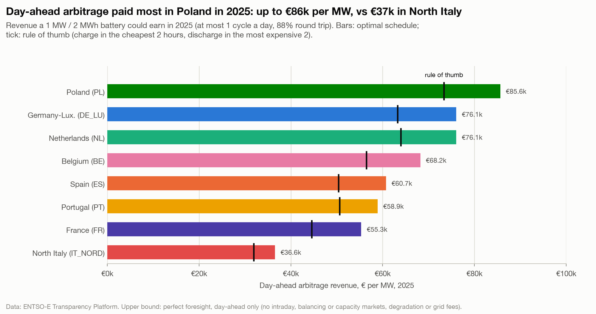

# Day-ahead arbitrage paid most in Poland in 2025: up to €85.6k per MW, vs €36.6k in North Italy

**Question:** Q3 · **Date:** 2026-10-03

## Headline
In 2025, a 1 MW / 2 MWh battery with perfect foresight of day-ahead prices could have earned at most **€85,640 per MW** in Poland, **€76,060** in Germany-Luxembourg and **€36,558** in North Italy, from day-ahead arbitrage alone.

## Evidence

| Zone | Revenue €/MW | Per day | Spread captured €/MWh | Rule of thumb €/MW | LP uplift |
|---|---:|---:|---:|---:|---:|
| PL | 85,640 | 234.63 | 131.90 | 73,368 | 16.7% |
| DE_LU | 76,060 | 208.38 | 116.15 | 63,265 | 20.2% |
| NL | 76,053 | 208.36 | 115.64 | 63,999 | 18.8% |
| BE | 68,212 | 186.88 | 104.06 | 56,508 | 20.7% |
| ES | 60,742 | 166.42 | 92.10 | 50,441 | 20.4% |
| PT | 58,915 | 161.41 | 89.68 | 50,636 | 16.4% |
| FR | 55,340 | 151.62 | 84.18 | 44,584 | 24.1% |
| IT_NORD | 36,558 | 100.16 | 65.19 | 31,949 | 14.4% |

- North Italy: GME accepts day-ahead offers only at or above 0 €/MWh, so prices there cannot go negative ([[Q1-3 Share of hours at or below zero 2026|Q1-3]]); its place in this ranking partly reflects that market rule. A battery there can never be paid to charge.
- The optimal schedule earns **7.8% to 29.3%** more than the rule of thumb (charge in the cheapest 2 hours, discharge in the dearest 2) across all full zone-years 2019 to 2025; 14.4% to 24.1% in 2025.
- The battery used about one full cycle every day in 2025 (363.5 to 365 cycles per zone).

**Benchmark (sanity check, not a match):** Gridcog reports "~70k" per year for a 1 MW / 2 h battery trading day-ahead only on 2024 German prices (cycles, efficiency, foresight not stated). This model gives **€66,047** for DE_LU 2024. The Enervis index (~€148,500/MW for Germany in 2025) covers intraday, FCR and aFRR at up to 1.5 cycles a day, so it is not comparable; it suggests day-ahead arbitrage is roughly half of what a German battery could earn across markets.

## Method
`fct_battery_arbitrage`, 2-hour battery: a linear program per zone and local day on cleared day-ahead prices at native resolution, 88% round trip, at most 1 cycle a day, empty at day ends ([[04 Decisions/ADR-007 Battery Arbitrage Model|ADR-007]]). Notebook `analysis/q3_battery_arbitrage.ipynb`, chart 1.

## Caveats
- **Upper bound for one market.** Perfect foresight of cleared prices; real bidders earn less from day-ahead alone. Excludes intraday, balancing and capacity markets, degradation, grid fees and all costs. Revenue is a gross trading margin, not profit. Not investment advice.
- Price-taker: a battery fleet large enough to move prices would shrink these spreads.
- No claim is made here about why Poland's spreads were the widest.

## So what?
On day-ahead spreads alone, the north-west (PL, DE_LU, NL, BE) offered a 2-hour battery roughly twice what North Italy did in 2025. A siting decision would also need the other revenue streams, grid fees and capex, which are out of scope here.

Sources: [Gridcog, The commercial opportunities for utility-scale batteries in Germany (Mar 2025)](https://www.gridcog.com/blog/the-commercial-opportunities-for-utility-scale-batteries-in-germany) · [ESS News, Enervis Battery Storage Index (28 Jan 2026)](https://www.ess-news.com/2026/01/28/enervis-battery-storage-index-december-revenues-fall-to-multi-month-low/)
