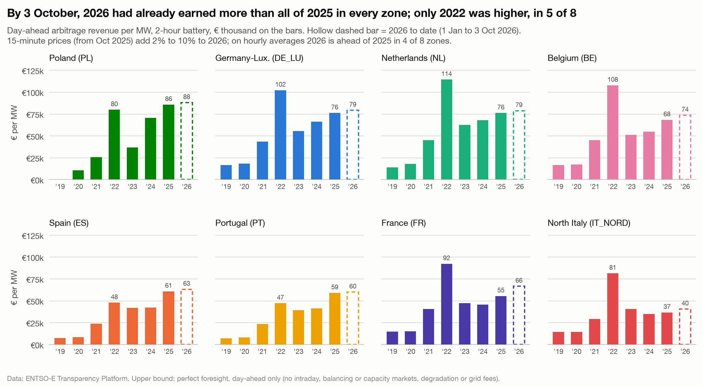

# By 3 October, 2026 had already earned more than all of 2025 in every zone

**Question:** Q3 · **Date:** 2026-10-03

## Headline
A 2-hour battery's day-ahead revenue for 1 Jan to 3 Oct 2026 already exceeds its full-year 2025 revenue in all 8 zones (DE_LU: €79,219 vs €76,060). 2022 remains the record year in 5 zones; in Spain, Portugal and Poland, 2026 to date is already the highest.

## Evidence

| Zone | 2019 | 2022 | 2023 | 2025 | 2026 to 3 Oct | 2026 on hourly prices | Added by 15-min |
|---|---:|---:|---:|---:|---:|---:|---:|
| PL | (PLN) | 79,785 | 36,674 | 85,640 | 87,903 | 82,489 | 6.6% |
| DE_LU | 16,471 | 102,138 | 55,478 | 76,060 | 79,219 | 75,306 | 5.2% |
| NL | 13,822 | 114,276 | 62,405 | 76,053 | 78,676 | 74,327 | 5.9% |
| BE | 16,572 | 107,719 | 51,210 | 68,212 | 73,541 | 68,814 | 6.9% |
| ES | 7,226 | 47,693 | 41,684 | 60,742 | 63,036 | 61,719 | 2.1% |
| PT | 6,879 | 47,111 | 39,241 | 58,915 | 59,843 | 58,637 | 2.1% |
| FR | 14,799 | 92,181 | 47,065 | 55,340 | 66,500 | 62,221 | 6.9% |
| IT_NORD | 14,326 | 81,296 | 40,609 | 36,558 | 40,471 | 36,862 | 9.8% |

(€ per MW, 2-hour battery.)

- Revenue rose 2.6× (IT_NORD) to 8.6× (PT) from 2019 to 2025.
- **15-minute prices** (since 1 Oct 2025) add 2.1% (ES, PT) to 9.8% (IT_NORD) to 2026 revenue. Re-solved on hourly averages, 2026 to date is still ahead of all of 2025 in 4 zones (BE, ES, FR, IT_NORD) but not in the other 4. So part of the "already beaten" headline is the finer resolution, and part is wider daily spreads (DE_LU: €273 a day on hourly prices in 2026 vs €208 in 2025).

## Method
`fct_battery_arbitrage` (2 h). The hourly comparison re-solves every 2026 day in the notebook with prices averaged per hour (section "How much of 2026 comes from 15-minute prices?").

## Caveats
- 2026 is 276 days; the comparison is year to date vs a full year, which makes the 2026 figure conservative, not inflated.
- Same upper-bound caveats as [[Q3-1 Where day-ahead arbitrage paid most in 2025|Q3-1]].
- No claim is made here about why 2026 daily spreads are wider.

## So what?
Day-ahead arbitrage value is not fading: on these numbers it has grown every year since 2023 in every zone except France and North Italy, which dipped in 2024. The move to 15-minute products is worth a few percent on top.
