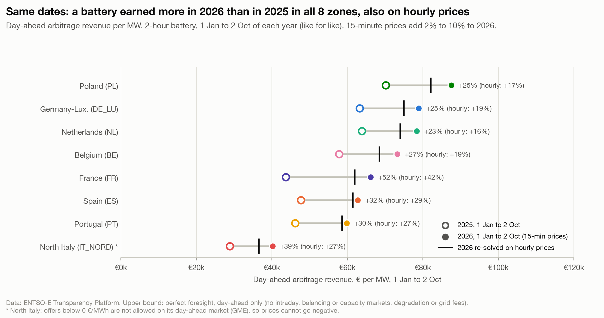

# Battery revenue over time: 2022 peak, and 2026 ahead of the same window of 2025

**Question:** Q3 · **Date:** 2026-10-03 · **Updated:** 2026-10-04

## Headline
Day-ahead arbitrage value peaked in 2022 in 5 of 8 zones; in Spain, Portugal and Poland the record full year was 2025. Over the same dates (1 Jan to 2 Oct), a 2-hour battery earned more in 2026 than in 2025 in all 8 zones: +23% (NL) to +52% (FR) at native prices, and +16% to +42% when 2026 is re-solved on hourly prices.

## Evidence

Full years (€ per MW, 2-hour battery):

| Zone | 2019 | 2022 | 2023 | 2024 | 2025 |
|---|---:|---:|---:|---:|---:|
| PL | (PLN) | 79,785 | 36,674 | 70,486 | 85,640 |
| DE_LU | 16,471 | 102,138 | 55,478 | 66,047 | 76,060 |
| NL | 13,822 | 114,276 | 62,405 | 67,940 | 76,053 |
| BE | 16,572 | 107,719 | 51,210 | 54,875 | 68,212 |
| ES | 7,226 | 47,693 | 41,684 | 42,148 | 60,742 |
| PT | 6,879 | 47,111 | 39,241 | 41,009 | 58,915 |
| FR | 14,799 | 92,181 | 47,065 | 45,396 | 55,340 |
| IT_NORD | 14,326 | 81,296 | 40,609 | 34,643 | 36,558 |

- Revenue rose 2.6× (IT_NORD) to 8.6× (PT) from 2019 to 2025.
- 2025 already includes 15-min prices in its last quarter (from 1 Oct 2025).

**2026, like for like.** 2026 is only compared with the same window of 2025 (1 Jan to 2 Oct, the as-of date; snapshot `analysis/outputs/snapshots/2026-10-02/`). To compare at the same resolution, every 2026 day is also re-solved on hourly averages of its prices.

| Zone | 1 Jan to 2 Oct 2025 | 1 Jan to 2 Oct 2026 | 2026 on hourly prices | Change | Change, hourly | Added by 15-min |
|---|---:|---:|---:|---:|---:|---:|
| FR | 43,704 | 66,218 | 61,947 | +52% | +42% | 6.9% |
| IT_NORD | 28,874 | 40,188 | 36,588 | +39% | +27% | 9.8% |
| ES | 47,697 | 62,771 | 61,464 | +32% | +29% | 2.1% |
| PT | 46,162 | 59,843 | 58,637 | +30% | +27% | 2.1% |
| BE | 57,808 | 73,257 | 68,539 | +27% | +19% | 6.9% |
| DE_LU | 63,263 | 78,911 | 75,007 | +25% | +19% | 5.2% |
| PL | 70,180 | 87,529 | 82,126 | +25% | +17% | 6.6% |
| NL | 63,832 | 78,382 | 74,041 | +23% | +16% | 5.9% |

(€ per MW, 2-hour battery.)

- 15-minute prices add 2.1% (PT) to 9.8% (IT_NORD) to 2026 revenue. Even without them, 2026 is ahead of the same window of 2025 in every zone, so the gain is mostly wider daily spreads, not the finer resolution.
- The 2025 window includes 1 and 2 Oct 2025, the first two days of 15-min prices; the rest of it is hourly.

## Method
`fct_battery_arbitrage` (2 h, full years) and `fct_ytd_comparison` (same window each year). The hourly comparison re-solves every 2026 day in the notebook with prices averaged per hour (`analysis/outputs/q3_hourly_resolve_ytd.csv`).

## Caveats
- 2026 to date is never compared with a full year here: a January to early October total is smaller than a full year by construction.
- Same upper-bound caveats as [[Q3-1 Where day-ahead arbitrage paid most in 2025|Q3-1]].
- North Italy: GME accepts day-ahead offers only at or above 0 €/MWh, so prices there cannot go negative ([[Q1-3 Share of hours at or below zero 2026|Q1-3]]); its place in this ranking partly reflects that market rule.
- No claim is made here about why 2026 daily spreads are wider.

## So what?
Day-ahead arbitrage value is not fading: over the same dates it is higher in 2026 than in 2025 in every zone, with or without 15-minute products. The move to 15-minute products is worth a few percent on top.
