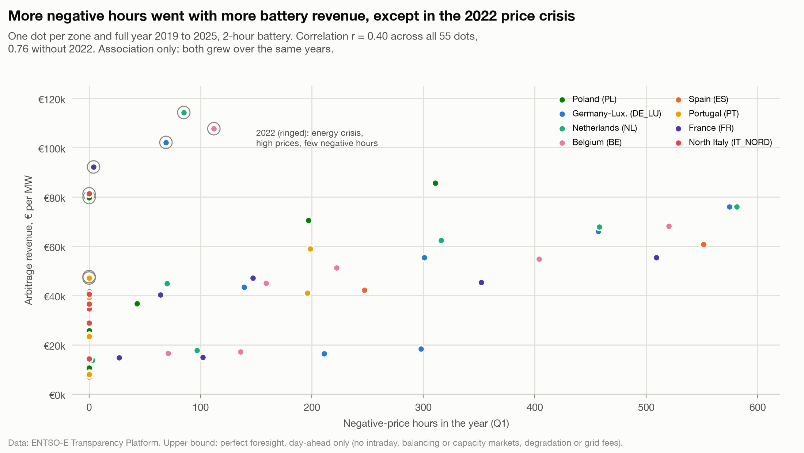

# More negative hours went with more battery revenue, except in the 2022 price crisis

**Question:** Q3 (links Q1) · **Date:** 2026-10-03 · **Updated:** 2026-10-04

## Headline
Across 55 full zone-years (2019 to 2025), revenue of a 2-hour battery correlates with negative hours (hourly mean below 0) at r = 0.40, and at **r = 0.76 without 2022**. These are not 55 independent observations, and both series trend upward over the same years (caveats). But being *paid to charge* is a small part of the money: at most 11.2% of a year's revenue (DE_LU 2020), 0 to 6.9% in 2025.

## Evidence

Correlation within each year (8 zones; 7 in 2019): 2019 0.56 · 2020 0.78 · 2021 0.89 · 2022 0.77 · 2023 0.95 · 2024 0.63 · 2025 0.58.

Share of revenue from charging at negative prices (2 h, 2025): BE 6.9% · NL 5.7% · DE_LU 5.0% · FR 3.8% · PL 3.6% · ES 0.7% · PT 0.2% · IT_NORD 0% (by market rule: no negative prices allowed, see Q1-3).

- 2022: few negative hours (0 to 112) but the highest revenue in 5 zones (NL €114,276).
- Spain 2025 bought 180.9 MWh per MW at negative prices but earned only 0.7% of its revenue that way: Spanish negative prices are shallow (Q1-2).

## Method
Join of `fct_battery_arbitrage` (2 h, full years) with `fct_negative_hours` on zone and local year; Pearson r. `negative_revenue_share` = money received for charging at negative prices / revenue. Notebook chart 3.

## Caveats
- **Association only.** Both negative hours and revenue grew over 2023 to 2025, so part of the correlation is a shared time trend; it does not show that negative hours cause revenue. Within-year correlations rest on 7 to 8 points each.
- **Zone-years are not independent.** Coupled zones share most of their prices, so their points move together: in 2025 Germany-Luxembourg and the Netherlands had 576 and 584 negative hours and €76,060 and €76,053 of revenue per MW, almost the same point twice. The effective number of observations is well below 55.
- **Revenue in euros tracks the general price level.** A spread between two hours scales with the level of prices, so a year of high prices pays more for the same daily shape. That is why 2022 is the outlier: prices were very high, negative hours were few.
- Negative hours matter for a battery mostly as a sign of a deep midday trough; most of the revenue comes from the evening sale price, not from the negative purchase price.

## So what?
Negative hours are a useful signal for where batteries earn more, but the money is in the spread, not in being paid to charge. A zone with frequent but shallow negative prices (Spain) gains little from them directly.
