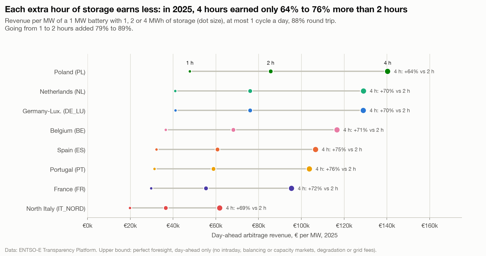

# Each extra hour of storage earns less: 4 hours earned only 64% to 76% more than 2 hours in 2025

**Question:** Q3 · **Date:** 2026-10-03

## Headline
In 2025, going from a 1-hour to a 2-hour battery raised day-ahead revenue per MW by 79% to 89%; doubling again to 4 hours raised it by only **64% to 76%**.

## Evidence

| Zone | 1 h €/MW | 2 h €/MW | 4 h €/MW | 2 h vs 1 h | 4 h vs 2 h |
|---|---:|---:|---:|---:|---:|
| PL | 47,846 | 85,640 | 140,336 | +79% | +64% |
| NL | 41,029 | 76,053 | 129,008 | +85% | +70% |
| DE_LU | 41,076 | 76,060 | 128,963 | +85% | +70% |
| BE | 36,621 | 68,212 | 116,667 | +86% | +71% |
| ES | 32,213 | 60,742 | 106,585 | +89% | +75% |
| PT | 31,258 | 58,915 | 103,689 | +88% | +76% |
| FR | 29,783 | 55,340 | 95,364 | +86% | +72% |
| IT_NORD | 19,836 | 36,558 | 61,780 | +84% | +69% |

North Italy: GME accepts day-ahead offers only at or above 0 €/MWh, so prices there cannot go negative ([[Q1-3 Share of hours at or below zero 2026|Q1-3]]); its place in this ranking partly reflects that market rule.

Per MWh of storage, a 4-hour battery earned €15,445 (IT_NORD) to €35,084 (PL) per MWh in 2025, against €19,836 to €47,846 for a 1-hour battery.

## Method
Same LP, power fixed at 1 MW, storage 1, 2 or 4 MWh (`battery_duration_h`), at most 1 cycle a day ([[04 Decisions/ADR-007 Battery Arbitrage Model|ADR-007]]). Notebook chart 4.

## Caveats
- Diminishing returns are expected: each extra hour trades a less extreme pair of hours.
- Per-MW revenue favours long batteries; whether that pays depends on the cost per MWh of storage, which is not modelled (no capex, no IRR).
- Iberia's gain from 4 hours is the largest (+75 to 76%), consistent with a long, flat midday trough; not tested further.

## So what?
Longer batteries earn more per MW of grid connection but less per MWh of storage. The trade-off is a cost question outside this project's scope.
