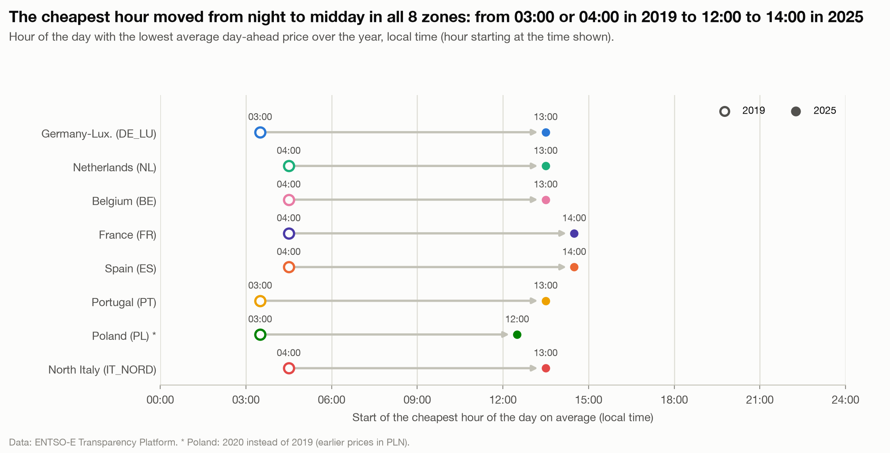
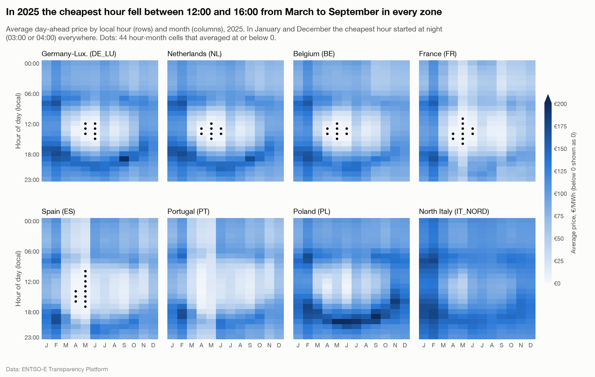

# The cheapest hour of the day moved from night to midday in all 8 zones

**Question:** Q4 · **Date:** 2026-10-03

## Headline
Over the year, the cheapest hour of the day started at 03:00 or 04:00 in 2019 in every zone, and at 12:00 to 14:00 in 2025. From March to September 2025, the cheapest hour of each month fell between 12:00 and 16:00 in all 8 zones.

## Evidence

| Zone | Cheapest hour 2019 | Avg price then (€/MWh) | Cheapest hour 2025 | Avg price then (€/MWh) |
|---|---|---:|---|---:|
| DE_LU | 03:00 | 27.73 | 13:00 | 45.99 |
| NL | 04:00 | 32.01 | 13:00 | 42.41 |
| BE | 04:00 | 28.10 | 13:00 | 41.21 |
| FR | 04:00 | 27.25 | 14:00 | 31.46 |
| ES | 04:00 | 40.50 | 14:00 | 27.34 |
| PT | 03:00 | 40.82 | 13:00 | 29.73 |
| PL* | 03:00 | 37.40 | 12:00 | 62.39 |
| IT_NORD | 04:00 | 40.04 | 13:00 | 91.37 |

\*PL: 2020 instead of 2019 (earlier prices in PLN, ADR-005).

- Winter is still a night market: in January and December 2025 the cheapest hour was 03:00 or 04:00 in every zone.
- 44 hour × month cells averaged at or below 0 in 2025, all in hours starting between 10:00 and 17:00 in April to June, in DE_LU, NL, BE, FR and ES.

## Method
`fct_hourly_profile` (duration-weighted mean per local hour, seasons combined with `covered_hours` as weights); the monthly heatmap is computed in the notebook from `int_prices_local`. [[04 Decisions/ADR-008 EV Charging Strategies|ADR-008]]. Notebook `analysis/q4_ev_charging.ipynb`, charts 1 and 2.

## Caveats
- Averages: individual days still vary (cloudy days, winter).
- No claim about causes beyond timing; the midday trough coincides with solar output (Q2), which this note doesn't test hour by hour.

## So what?
"Charge at night" was the right default in 2019. From spring to early autumn it no longer is anywhere in these 8 zones: midday is cheaper.
