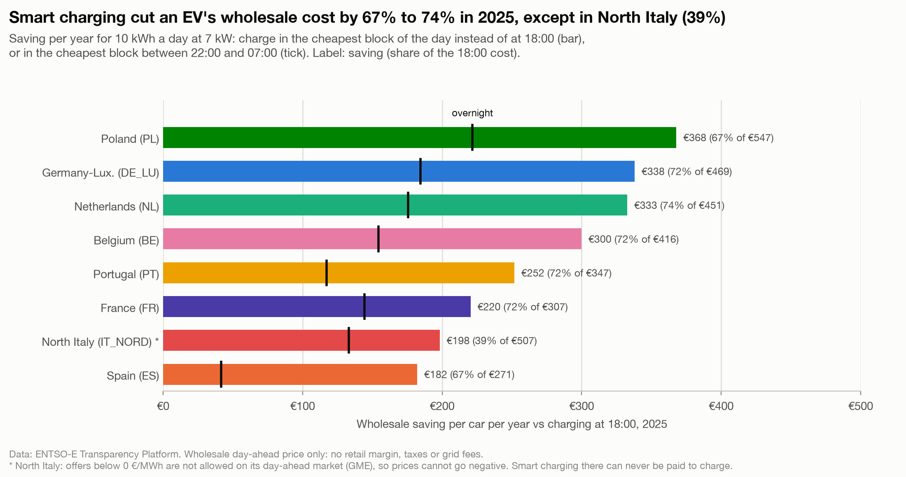

# Smart charging cut an EV's wholesale charging cost by 67% to 74% in 2025, except in North Italy (39%)

**Question:** Q4 · **Date:** 2026-10-03 · **Updated:** 2026-10-04

## Headline
For an EV charging 10 kWh a day at 7 kW, choosing the cheapest block of each day instead of plugging in at 18:00 saved **€182 to €368 per year** of wholesale cost in 2025 (67% to 74%), and €198 (39%) in North Italy.

## Evidence

| Zone | 18:00 €/yr | Overnight €/yr | Smart €/yr | Smart saving | Share | Price paid 18:00 / smart (€/MWh) |
|---|---:|---:|---:|---:|---:|---|
| PL | 547.33 | 325.64 | 179.46 | 367.87 | 67.2% | 149.95 / 49.17 |
| DE_LU | 469.11 | 284.66 | 131.13 | 337.97 | 72.0% | 128.52 / 35.93 |
| NL | 451.09 | 275.53 | 118.45 | 332.64 | 73.7% | 123.59 / 32.45 |
| BE | 415.83 | 261.35 | 115.97 | 299.86 | 72.1% | 113.93 / 31.77 |
| PT | 347.49 | 230.24 | 95.76 | 251.73 | 72.4% | 95.20 / 26.24 |
| FR | 307.38 | 163.19 | 87.03 | 220.35 | 71.7% | 84.21 / 23.84 |
| IT_NORD | 507.04 | 373.80 | 308.83 | 198.21 | 39.1% | 138.92 / 84.61 |
| ES | 271.11 | 229.64 | 89.00 | 182.11 | 67.2% | 74.28 / 24.38 |

- In spring 2025, smart charging in **Belgium and the Netherlands was paid on balance**: average price paid −0.29 and −0.22 €/MWh (savings share just over 100%).
- In full years the smart saving share grew from 22% to 49% in 2019 to 67% to 74% in 2025 (outside IT_NORD). Over the same dates (1 Jan to 2 Oct; snapshot `analysis/outputs/snapshots/2026-10-02/`) it was 67% to 80% in 2025 and 74% to 83% in 2026 (outside IT_NORD).
- North Italy: GME accepts day-ahead offers only at or above 0 €/MWh, so prices there cannot go negative ([[Q1-3 Share of hours at or below zero 2026|Q1-3]]); its place in this ranking partly reflects that market rule. Smart charging there can never be paid to charge, which caps its saving.

## Method
`fct_ev_charging`, season `year`: one continuous 1 h 26 min block per day at native price resolution; € per year = average daily cost × 365 ([[04 Decisions/ADR-008 EV Charging Strategies|ADR-008]]). Hand-checked on DE_LU 15 Jun 2024. Notebook chart 3.

## Caveats
- **Wholesale component only**: retail margins, taxes and grid fees are excluded, and they are most of a household bill. The savings only reach a driver on a dynamic (day-ahead-indexed) tariff.
- "Smart" assumes the car is plugged in during the day, which suits home chargers with daytime parking, workplaces and fleets, not every commuter.
- Price-taker: if many EVs move to the same hours, the trough fills.

## So what?
Timing roughly cuts the wholesale energy cost of charging by two thirds to three quarters. The absolute amount per car is modest (a few hundred € a year); for fleets it scales with the number of vehicles.
